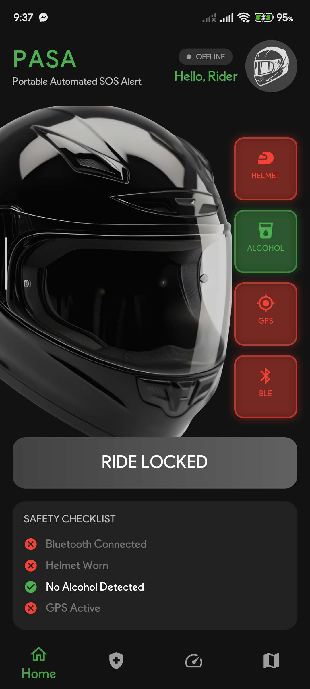
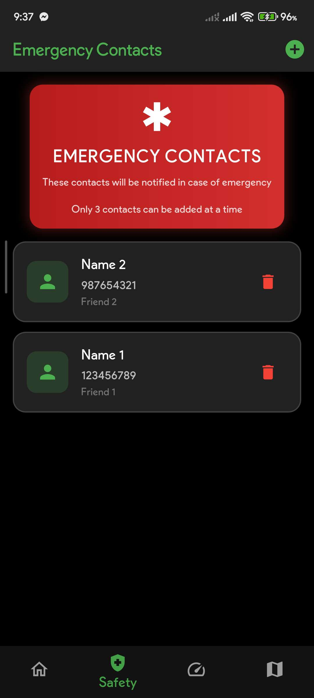
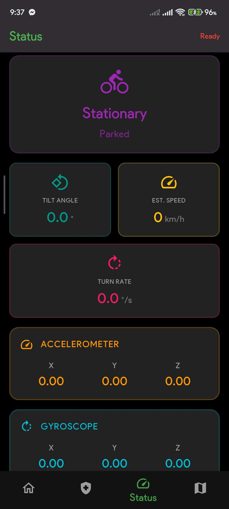
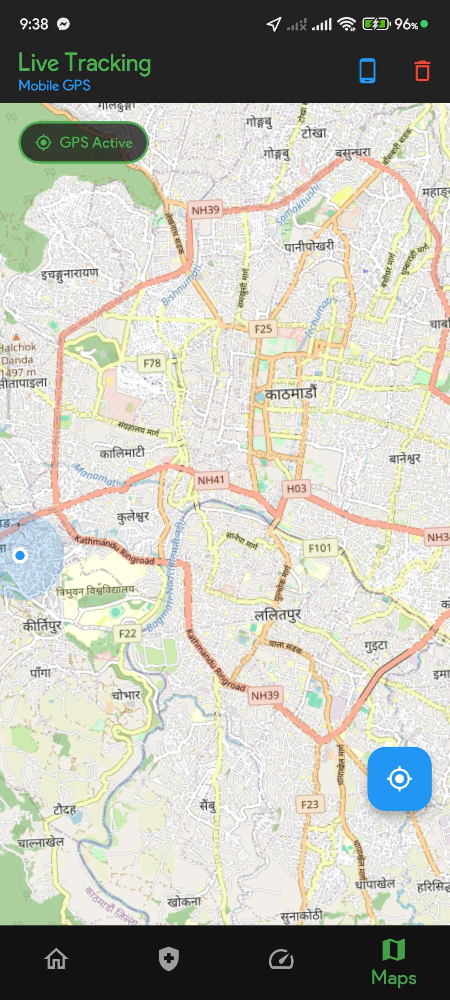
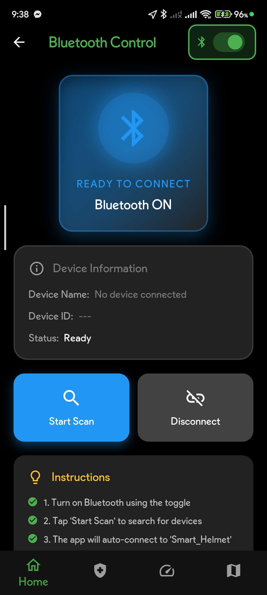
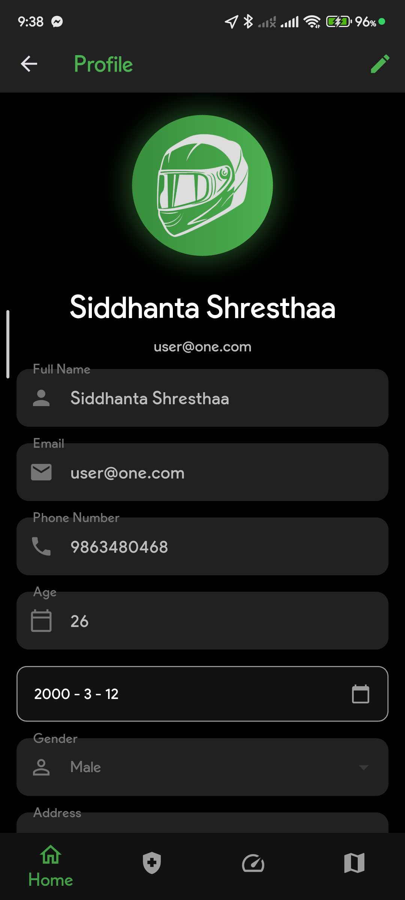

# 🪖 PASA – Smart Helmet Safety System (Mobile App) {UI Screenshots Below} {Android APK in Releases}

**PASA** is a Flutter-based mobile application built to enhance rider safety by integrating with a smart helmet system. The app detects accidents through helmet sensors and immediately triggers emergency alerts with location sharing to predefined contacts.

## 📽️ Full System Demonstration Video 
👉 [Watch Project Demo](https://drive.google.com/file/d/1mVAcl6Bb3cz96yrwY0p5WzqenNFSkbIX/view?usp=sharing)

## 🚀 Overview

PASA connects a smart helmet hardware unit with a mobile application to enable real-time accident detection and emergency response. When a crash or abnormal impact is detected, the system automatically sends an SOS alert with the rider’s location.

Key features include:

- 🆘 Automatic accident detection and SOS alerts  
- 📍 Live GPS location tracking and sharing  
- 🔗 Bluetooth Low Energy (BLE) helmet connectivity  
- 👤 User authentication and profile management  
- 📞 Emergency contact management system  
- 🚴 Ride session tracking and monitoring  
- 🔔 Real-time alerts from helmet hardware  
- ⚙️ Device pairing and connection status control  

The frontend is built using **Flutter** and communicates with the helmet hardware via **BLE**, along with optional backend services for logging and alert handling.

## 🛠️ Technologies Used

- Flutter (Dart)
- Bluetooth Low Energy (BLE)
- Supabase

## 🏗️ System Architecture

- 🪖 Helmet Hardware Unit (Sensors + Microcontroller)
- 📱 Mobile Application (Flutter Frontend)
- ☁️ Backend Server (Supabase)

## 📸 Screenshots

<table>
  <tr>
    <td></td>
    <td></td>
  </tr>
  <tr>
    <td></td>
    <td></td>
  </tr>
  <tr>
    <td></td>
    <td></td>
  </tr>
</table>

