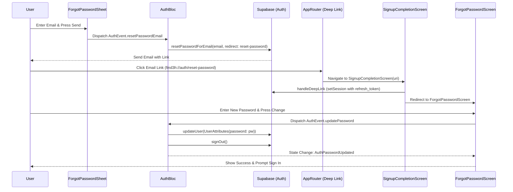

# Password Reset Flow Analysis

This document outlines the end-to-end flow for the password reset feature in the Find3h Flutter application.

## High-Level Flow Diagram



## Detailed Flow Breakdown

### 1. Requesting a Password Reset

**UI Component: `ForgotPasswordSheet`**
- **File**: `lib/feature/auth/components/forgot_pw_sheet.dart`
- **Action**: User enters email and clicks "Send".
- **Logic**:
  - Validates email via `AuthHelper.validateEmail`.
  - Dispatches `AuthEvent.resetPasswordEmail(email: email)` to `AuthBloc`.
  - **Listener**: On `AuthResetPasswordSent`, it navigates to `AppRoutes.forgotPasswordVerification` (a static info screen).

### 2. Processing the Request (Backend/Service Layer)

**BLoC: `AuthBloc`**
- **File**: `lib/feature/auth/bloc/auth_bloc/auth_bloc.dart`
- **Method**: `_onResetPassword`
- **Logic**: Calls `repository.resetPasswordEmail(event.email)` and emits `AuthState.resetPasswordSent`.

**Service: `AuthServices` (via Supabase)**
- **File**: `lib/feature/auth/services/auth_services.dart`
- **Method**: `resetPasswordEmail`
- **Implementation**:
  ```dart
  await _supabase.auth.resetPasswordForEmail(
    email,
    redirectTo: 'find3h://auth/${AppLinkUrls.resetPassword}',
  );
  ```
  - **Note**: `AppLinkUrls.resetPassword` is the string `'reset-password'`.

### 3. Handling the Deep Link (App Re-entry)

**Router: `AppRouter`**
- **File**: `lib/config/router/app_router.dart`
- **Action**: Captures `find3h://auth/reset-password`.
- **Mapping**: Matches path `/reset-password` and routes to `SignupCompletionScreen(uri: state.uri)`.

**Screen: `SignupCompletionScreen` (Deep Link Processor)**
- **File**: `lib/feature/auth/screens/signup/signup_completion.dart`
- **Method**: `_process()`
- **Implementation**:
  1. Calls `sessionService.handleDeepLink(widget.uri)`.
  2. Waits for a valid session via `sessionStream.firstWhere((s) => s != null)`.
  3. If `uri.path == '/reset-password'`, it navigates to `AppRoutes.forgotPassword.name` (`ForgotPasswordScreen`).

**Service: `UserSessionService`**
- **File**: `lib/core/services/user_session_service.dart`
- **Method**: `handleDeepLink`
- **Action**: Parses the URI fragment for `refresh_token`. If found AND no current session exists, it calls `_supabase.auth.setSession(refreshToken)`.

### 4. Updating the Password

**Screen: `ForgotPasswordScreen` (Set New Password Screen)**
- **File**: `lib/feature/auth/screens/forgot_password/forgot_password_screen.dart`
- **Action**: User enters and confirms new password.
- **Logic**:
  - Uses `PasswordWithConfirmation` for validation.
  - Dispatches `AuthEvent.updatePassword(password: pw)` to `AuthBloc`.

**BLoC: `AuthBloc`**
- **Method**: `_onUpdatePassword`
- **Implementation**:
  1. Calls `repository.updatePassword(event.password)`.
  2. Calls `repository.signOut()` immediately after update.
  3. Emits `AuthState.passwordUpdated()`.

**Service: `AuthServices`**
- **Method**: `updatePassword`
- **Implementation**:
  ```dart
  await _supabase.auth.updateUser(UserAttributes(password: password));
  ```

### 5. Completion
- **UI**: The `ForgotPasswordScreen` listener detects `AuthPasswordUpdated`, shows a success snackbar, and because `signOut()` was called, the router's redirect logic will likely send the user back to the `SignInScreen`.

---

## Technical Notes for Implementation
- **Redirect Scheme**: Ensure `find3h` is registered in `AndroidManifest.xml` and `Info.plist`.
- **Supabase Fragment**: Supabase passes tokens in the URL fragment (`#`), not query parameters. `UserSessionService` correctly handles this by parsing `uri.fragment`.
- **Sign Out Logic**: Forcing a sign-out after a password update is a security best practice to ensure old sessions are invalidated and the user knows their new credentials work.
